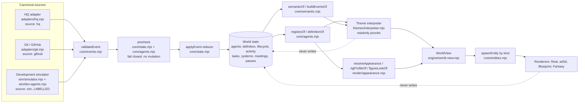
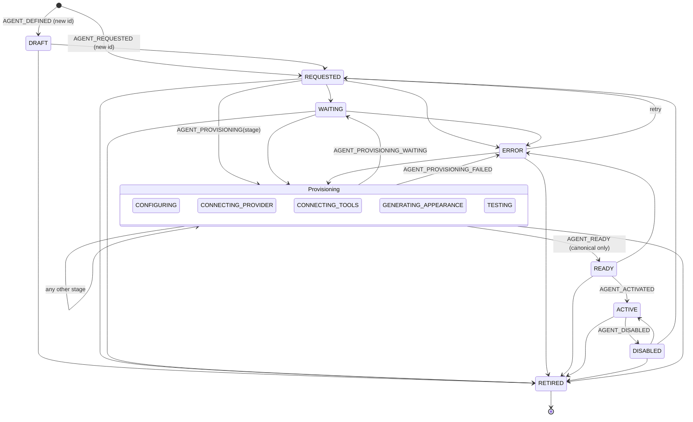
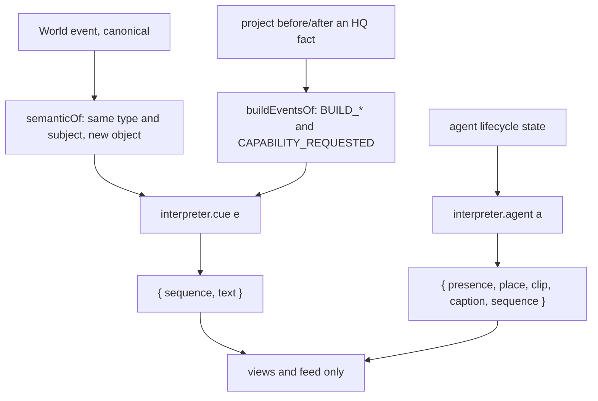

# Pass 5E: Agent registry, lifecycle and theme interpretation

Status: **built by Claude** on branch `claude/world-5e`. Nothing is merged or deployed. Fantasy interpretation (5G) and the art pass have **not** started.

What this pass is for: nothing in the World depends on a hard-coded agent id, role or look. The agents Hillink has today are **default definitions** in the same schema a brand new agent uses. An agent's life (requested, provisioning, ready, active, disabled, retired) is canonical state that only validated events move. Themes decide how those facts **look**, through a read-only interpreter that can never change them.

## Architecture

The arrows only go one way. Renderers, themes and the interpreter read; the only writers are validated events from HQ, Git/GitHub or the labelled simulator.

## Registry and definition schema (`core/agents.mjs`)

Only `id` is required. Everything else is optional, bounded and normalized by `normalizeDefinition`.

| Field | Meaning |
|---|---|
| `id` | stable agent id (the key everything refers to) |
| `name`, `kind` | display name; `agent`, `process` or `person` |
| `provider`, `model` | backend or vendor; model name when applicable |
| `role`, `roleTitle`, `roleDescription` | HQ's role line, short title, purpose |
| `responsibilities`, `capabilities`, `tools`, `permissions` | lists (max 40 items, 80 chars each). Permissions are descriptive here; HQ enforces them |
| `team`, `reportsTo`, `coordinatesWith` | organisation |
| `workstation` | `{ kind?, location?, uses?[] }` |
| `home` | optional semantic location id |
| `appearance` | appearance definition (below) |
| `meta` | free metadata, bounded JSON |
| `extra` | unknown top-level fields from a newer HQ, kept (bounded, 8 KB), never dropped silently |

Rules:
- Text is trimmed and clipped; free-form JSON is capped at 8 KB and anything non-plain is dropped.
- `mergeDefinitions`: later wins. Appearance merges **per theme**, so updating one theme's look keeps the others. `meta`, `extra`, `workstation` merge shallowly.
- `definitionOf(agent)` = the shipped default definition (if any) under what canonical events said. Works for any id.
- `registryOf(world)` = every agent the World knows, as definitions.
- A stale `AGENT_DEFINED` (older than the applied one) is refused.

### Appearance (`render/appearance.mjs`)

One canonical agent, many representations: a theme neutral base plus `themes.<id>` overrides. Fields: `archetype`, `rig`, `body`, `palette`, `hair`, `face`, `clothing`, `accessories`, `equipment`, `effects`, `animationSet`, `sprite`, `figure`, `themes`.

- `resolveAppearance(app, theme)`: base, then the theme override. Blueprint uses Real.
- `rigProfileOf`: only `humanoid` is drawn today. An unknown rig (for example `golem`) falls back to the humanoid at its declared `heightScale` and records `fallbackFrom`, so it still appears and behaves.
- `figureLookOf`: a definition that carries `figure` gets exactly those renderer params (this is how the default agents look unchanged). Any other definition is built from generic fields (palette, clothing, accessories, body), so a new agent needs no renderer change and no code keyed by its id.

## Lifecycle

Also allowed: REQUESTED, any provisioning stage, WAITING, ERROR and READY can go to DISABLED. The table is `TRANSITIONS` in `core/agents.mjs`.

Presence (`presenceOf`), which is all a view needs:
- **member**: ACTIVE or READY, or no lifecycle at all (registered the pre 5E way by HQ or the simulator). Can hold work.
- **candidate**: REQUESTED, provisioning stages, WAITING, ERROR. Staged by the theme, cannot be given work.
- **absent**: DRAFT, DISABLED, RETIRED. Not in the building, not in the roster or counts.

Guarantees (enforced in `precheck` before the reducer mutates anything, so a refused event leaves the World identical):
- Only transitions in the table; unknown stages refused; out of order events (older than the current state) refused.
- `READY` only arrives as a canonical event. No animation, timer or theme can produce it.
- Work events (`TASK_STARTED`, `AGENT_STARTED_WORK`, thinking, reviewing, testing and so on) are refused for an agent that is not a member.
- Leaving membership drops the agent's active task back to the queue and ends its meeting.
- **Source families never mix**: an agent first defined by `hq`/`github`/`platform` (live) can never be changed by `sim`, and a simulated agent never receives HQ facts. `replay` may restate either.
- `WorldStore.reset` (replay) is idempotent by event id.
- Lifecycle history is kept per agent (last 12 entries).

HQ today supports only part of this: an agent HQ registers is simply there (ACTIVE). The provisioning states exist so a backend that does provision can report them, and so the development harness can exercise them. Nothing in the World advances them on its own.

## Event and theme boundary

- Semantic names say **what happened**, never how it looks (no PORTAL, HAMMER, INTERVIEW in the event vocabulary). The vocabulary is `SEMANTIC` in `core/semantic.mjs` and grows only when a backend reports something new.
- A theme is a table: `agent[lifecycleState]` and `events[semanticType]`. Missing entries fall back through `extends` to NEUTRAL, so an empty new theme works.
- The interpreter gets **read-only proxies** (`readonly()`): any write at any depth throws. It returns presentation objects and never dispatches events. A sequence finishing, looping or failing on screen cannot create, advance or undo an HQ fact.
- Real stages candidates in the lobby onboarding area ("Onboarding: tool access", "Onboarding failed") and walks them to the team only after READY and ACTIVE arrive. Fantasy currently extends Real; its own table (summoning chamber, portal runes) is 5G and only changes this table.

## Canonical vs visual

| Canonical (mirrors truth, from events only) | Visual only (cosmetic, never read as fact) |
|---|---|
| Agent definition, lifecycle state and history, presence | Where a candidate stands, its clip and caption |
| Agent activity, task, meeting (from HQ/sim events) | Named sequences (`candidate-arrives`, `interview`, `joins-team`, `leaves-office` ...) |
| Tasks, systems, issues, meetings, construction passes | Feed wording from the theme (`"X finished onboarding"`) |
| Construction semantic events (BUILD_*) derived from canonical project state | Figure look, rig height, archetype per theme |
| Source family (live vs sim) | Ambient staff, pedestrians, occluders, lifts (entity kinds `ambient`, `npc`, `occluder`, `liftBack/Front`: `canonical: false`) |

Entity kinds (`core/entities.mjs`) declare this as data: `layer`, `selectable`, `canonical`. Views spawn through `spawnEntity`, so a new kind (subagent, visitor, portal, vehicle) needs no view change. Planned kinds are listed as documentation only.

## Development harness (SIMULATION)

`sim/dev-agents.mjs` holds two fixture agents, `agent-test-unknown` and `agent-test-second`. They exist only in the simulator (source `sim`). HQ knows nothing about them, and no provider, tool connection or provisioning happens. No code tests for them by name. The second one declares a `golem` rig (not drawn yet, so it falls back to humanoid at 1.15 height) and an unknown future field (kept under `extra`).

Scenarios in the simulator menu, all prefixed `DEV:`: onboard an unknown agent, onboard two, provisioning fails (at CONNECTING_TOOLS), unknown agent works, disable, retire.

## Evidence (`docs/world/evidence/pass5e/`)

**Live HQ was not available** during this pass (nothing listening on `127.0.0.1:4312`). Every capture below is from the development simulator (`?source=sim&theme=real&art=5d`, seed `hillink`, current 5D art). **All of it is SIMULATION**; B to E are also the DEVELOPMENT HARNESS (fixture agents, simulated provisioning).

| Id | Files | Shows |
|---|---|---|
| A (SIMULATION) | `A-claude-living-hq-lifecycle-after-migration.mp4` (80 s), `A1-…png`, `A2-…png` | Claude, now a default definition, still picks up a task and types exactly as in the Living HQ pass |
| B (SIMULATION, DEV HARNESS) | `B-D-unknown-agent-onboarding-then-working-DEV-HARNESS.mp4` (75 s), `B1-…`, `B2-…` | An unknown agent arrives as a candidate, waits in onboarding through each stage, walks in after READY/ACTIVE and works |
| C (SIMULATION, DEV HARNESS) | `C-two-dynamic-agents-DEV-HARNESS.mp4` (45 s), `C1-…` | Two dynamic agents with different definitions and looks (one with the fallback rig) |
| D (SIMULATION, DEV HARNESS) | `D-provisioning-fails-DEV-HARNESS.mp4` (30 s), `D1-…` | Provisioning fails at tool connection; the agent stays a candidate showing "Onboarding failed" and never gets work |
| E (SIMULATION, DEV HARNESS) | `E-disable-dynamic-agent-world-stays-coherent-DEV-HARNESS.mp4` (75 s, re-recorded), `E1-…` | Disabling the dynamic agent: it leaves, its task goes back to the queue, roster and counts stay coherent |

Capture metadata (paths, world fingerprint, fps): `notes.json`, `shots.json`, `clips.json`, `video-notes.json`. The A file name predates the label; it is simulation like the rest.

## Tests

`tools/hillink-world/tests/pass5e.test.mjs` (11 tests) covers the registry and schema, default migration (the default agents render identically), lifecycle transitions and fail closed refusal, READY only from events, source family separation, the interpreter's read-only boundary, replay idempotency, and dynamic agents end to end. The Living HQ regressions are `hq-life.test.mjs` and `truth.test.mjs`. Run everything with `npm run test:world` (17 files, 162 tests by static count).

## Limitations

- HQ does not provision agents yet. It reports registration only, so live agents are always ACTIVE. The provisioning states are exercised only by the labelled simulator.
- HQ sends only some definition fields today (`provider`, `model`, `team`, `description`, `capabilities`, `tools` when present). The rest stays empty until HQ reports it.
- Only the humanoid rig is drawn. Other rigs fall back with their declared height.
- Named sequences are recorded in the theme table, but most are staged by placement, clip and caption rather than bespoke animation. No new art in this pass.
- Fantasy uses Real's staging until 5G.
- `permissions` are descriptive in the World; HQ is the enforcer.
- `EXTRA_AGENTS` in the simulator (sales, support ...) still register the pre 5E way; they get definitions through `definitionOf` like any other agent.

## Migration notes

- Per id tables are gone as sources of truth: `core/roles.mjs`, `render/looks.mjs`, the simulator roster and git attribution now read `DEFAULT_DEFINITIONS`. Each default carries a `figure` block with the exact previous renderer parameters, so the existing agents look the same.
- `AGENT_REGISTERED` still sets `name`, `role`, `kind`, `appearance` on the agent (older code reads them) and now also merges them into `agent.definition`. The first source to touch an agent is recorded as `agent.origin`.
- An agent with no `lifecycle` is treated as ACTIVE, so worlds, snapshots and journals saved before 5E replay unchanged.
- New event types (`AGENT_DEFINED`, `AGENT_REQUESTED`, `AGENT_PROVISIONING`, `…_WAITING`, `…_FAILED`, `AGENT_READY`, `AGENT_ACTIVATED`, `AGENT_DISABLED`, `AGENT_RETIRED`) are additive; an older World rejects them as unknown without crashing.
- `WorldView` takes an optional fifth argument, the interpreter (Real by default). Views now spawn scene entities through `spawnEntity`.
- To add a theme: `defineTheme(id, { extends, agent, events })`. To add a rig: `defineRig`. To add an entity kind: `defineEntityKind`.
