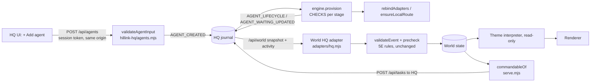

# Pass 5F: Real agent creation and provisioning

Status: **built by Claude** on branch `claude/world-5f` (from `claude/world-5e-fix-cloud` @ `e39a275`). Not merged or deployed. 5E is unchanged apart from the two fixes listed under "Touches to 5E".

What this pass does: Kyle creates an agent in HQ whose id the source has never seen (for example `agent-5f-unknown-927`). HQ provisions it through real checks, and Kyle activates it. It then joins the World, takes real work routed by capability, and survives a restart and a reload. The World only renders what HQ journals and never decides that provisioning succeeded.

## Architecture

HQ is the only creation authority. The World has no endpoint that creates or advances an agent. Its adapter translates `AGENT_CREATED` into `AGENT_REQUESTED` and each `AGENT_LIFECYCLE` into the matching 5E lifecycle event. After that, the unchanged 5E precheck applies (candidate vs member, family isolation, fail-closed).

## Files

| File | Change |
|---|---|
| `tools/hillink-hq/agents.mjs` | **New.** Lifecycle table (identical to the World's; a test asserts it), catalog (capabilities, tools, permissions, backends), `validateAgentInput`, stage checks, `trial`, binding and `ensureLocalRoute` |
| `tools/hillink-hq/engine.mjs` | Reducer for 3 new events. `createAgent`, `activateAgent`, `retryAgent`, `disableAgent`, `retireAgent`, async `provision`. `isWorking` gating in compute selection, recovery, `createTask`, observation and watchdog |
| `tools/hillink-hq/server.mjs` | Catalog and agent endpoints; provisioning config; adapters rebound on start |
| `tools/hillink-hq/public/*` | "+ Add agent" form built from the catalog, lifecycle badges, history and action buttons in the inspect panel |
| `tools/hillink-world/adapters/hq.mjs` | `worldDefinitionOf`, lifecycle mapping, snapshot replay of lifecycle history, legacy appearance fix |
| `tools/hillink-world/serve.mjs` | `publicDefinition` (drops `instructions`, `meta`), capability-based `commandableOf` replaces the hard-coded COMMANDABLE list |
| `tools/hillink-world/world/generated-layout.mjs` | `overflowSpots(locationId)`: reachable free cells, one body-width apart |
| `tools/hillink-world/core/behavior.mjs` | Agents without a desk get overflow spots per room |
| `tools/hillink-world/core/truth.mjs` | Ignores a stale WORKING runtime report for a task the World already saw end |
| `tools/hillink-world/live/pass5f-live.mjs` | **New.** Live evidence script (real HQ + World server + headless Chromium) |
| tests | `hillink-hq/tests/agents.test.mjs` (13), `hillink-world/tests/pass5f.test.mjs` (12); pass1/pass25 fakes gained capabilities |

## API (HQ, owner-only: loopback, same origin, session token)

| Method | Path | Body | Result |
|---|---|---|---|
| GET | `/api/agents/catalog` | none | capabilities, tools, permissions, backends |
| POST | `/api/agents` | definition (5E schema + `backend`, `capabilities`, `tools`, `permissions`, `instructions`) | `201 {id}` or `400 {error}` |
| POST | `/api/agents/activate` | `{id}` | READY or DISABLED(readied) → ACTIVE |
| POST | `/api/agents/retry` | `{id}` | ERROR or WAITING → REQUESTED |
| POST | `/api/agents/disable` | `{id, reason?}` | → DISABLED; a running task is cancelled and requeued (or parked) |
| POST | `/api/agents/retire` | `{id, reason?}` | → RETIRED, terminal |

## Lifecycle

`REQUESTED → CONFIGURING → CONNECTING_PROVIDER → CONNECTING_TOOLS → TESTING → READY → (Kyle) ACTIVE`, with `WAITING`, `ERROR`, `DISABLED` and `RETIRED` from the shared table. Each stage runs a real check:

| Stage | Check |
|---|---|
| CONFIGURING | The definition resolves against the catalog: the backend is known and the model is valid for it; every capability has a tool and every tool has its permission |
| CONNECTING_PROVIDER | Real provider probe (the local repo, an Ollama `/api/tags` model list, or the CLI `auth status`). Missing or not signed in means WAITING with an owner action, rechecked every 15s |
| CONNECTING_TOOLS | Each tool's probe runs; each capability binds to an adapter and its route must be $0 compute |
| TESTING | A real trial: local-checks runs `inspect-repo`; Ollama runs a small local generation. CLI backends verify the subscription sign-in only and make **no model call** |

READY is a candidate, not a member (5E rule). Only Kyle's activation makes the agent ACTIVE, and only ACTIVE agents receive tasks, commands or compute.

## Providers and capabilities

| Backend | Capabilities | Cost route |
|---|---|---|
| local-checks | inspect-repo, verify-unit, verify-hq | LOCAL |
| ollama (per-model route) | summarize | LOCAL |
| claude-cli | review-repo | SUBSCRIPTION (shared CLI adapter) |
| codex-cli | review-repo | SUBSCRIPTION (shared CLI adapter) |

Reserved and refused at creation: implement-repo, implement, coordinate and owner-decision. HQ-created agents may hold only the `read-repo` and `run-local-checks` permissions. Structure is capability → tool → permission, and no identity is special-cased. No metered API backend exists, so ZERO_CREDIT holds. A backend that cannot run a capability is refused, with no silent fallback to Claude.

## Security

- The endpoints sit behind the existing owner gate. Without a session token the result is 401 (live).
- Strict validation: unknown fields are refused; lengths are bounded; name, id and model match patterns; ids are unique and reserved ids are refused. Escalation to `write-repo` is refused (live 400).
- Appearance is data only: `#rrggbb` colours, enum items, archetypes, rig `humanoid`, bounded body, and themes limited to `real`/`fantasy`. A hostile CSS colour is refused (live 400). Attribution tokens are literal strings; no regex or code is accepted.
- `instructions` and `meta` stay in HQ. `publicDefinition` drops them before anything reaches the World server, the snapshot or the browser. No provider secrets exist in the definition; the CLIs hold their own sign-in.
- A live World page refuses sim events (live).

## Persistence

Everything is journal events (`AGENT_CREATED`, `AGENT_LIFECYCLE`, `AGENT_WAITING_UPDATED`). After an HQ restart, the definition and lifecycle came back identical, the World reloaded from the snapshot (whose lifecycle history replays through the same events), and the agent completed new work (live).

## Routing

`commandableOf(agents)` exposes a World command for an agent only when that agent is ACTIVE and holds a capability that maps to a command operation. HQ's `createTask` with `preferredAgentId` refuses a non-working agent (live: 400 before activation). When a disable requeues a task, the task's preference is released so another working agent can take it.

## World onboarding and workstation

The interpreter and renderer are unchanged. A candidate shows at onboarding, ACTIVE members get a desk, and when every desk is taken they get non-overlapping, reachable overflow spots in their room (tested with 2 and with many dynamic agents). The HQ appearance `{real, fantasy}` is now placed under `appearance.themes` (the 5E bug).

## Evidence (live in this cloud container, 2026-09-30)

`evidence/pass5f/pass5f-live-results.json` and screenshots 1–7. Everything below is **LIVE** (real HQ process, real checks, real local processes, real Chromium) except the Ollama path, which is unit-tested only.

| Demo | Result |
|---|---|
| A. Create unknown id | `agent-5f-unknown-927` → 201, provisioned to READY with a real `inspect-repo` trial |
| B. Second dynamic agent | `tester-5f-86b797` READY, then ACTIVE |
| C. Bad model | ERROR at CONFIGURING |
| D. Missing permission | ERROR at CONNECTING_TOOLS |
| E. Provider unavailable | Codex reviewer WAITING ("Codex CLI not found on PATH", owner action shown) |
| F. Subscription provider | Claude reviewer READY via `claude auth status`, no model call |
| G. Work | World command → scout task DONE (164 paths); tester `verify-hq` DONE (30 passed) |
| H. Disable mid-work | Run CANCELLED, task requeued with preference released, finished by `hq-verifier` |
| I. Restart + reload | Identical definition and lifecycle; post-restart task DONE |
| J. Security | 401 without a session; 400 for escalation; 400 for a hostile colour |
| K. Sim isolation | Live page refused a sim event |
| L. Retire | RETIRED; reactivation refused with 400 |
| Page errors | none |

## Limitations (honest list)

- **Ollama** is not installed in the cloud container, so the Ollama backend (model probe, local trial, per-model route) is covered by unit tests with a fake HTTP server, not a live run.
- **Codex CLI** is not installed in the cloud container, so the WAITING path is live and the Codex READY path is not.
- **CLI trials make no model call.** To keep subscription capacity, READY for claude-cli/codex-cli means the sign-in was verified and the route is $0. The first real review is the first model call.
- **Archive walk lag:** after a task finishes, the World's archive journey waits for HQ's next idle observation (a keep-alive, 5 minutes by default). This lag was already there before 5F.
- **workstation.kind** is validated and stored but placement does not enforce it yet (desk first, then overflow).
- **GENERATING_APPEARANCE** is in the shared table but HQ never enters it; the appearance is validated data or a generated default.
- **Disable when a stop can't be confirmed:** the task is parked (TASK_PARKED) for Kyle rather than requeued, so it can't run twice.
- Retire is terminal by design. Re-hiring means creating a new agent.
